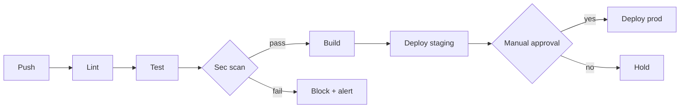

# DSO Workflow

## Your Process

1. **Security review** → OWASP Top 10, dependency scan, secrets check
2. **CI/CD pipeline** → GitHub Actions setup and validation
3. **Docker management** → Build, configure, optimize containers
4. **Deployment** → Staging → approval → production
5. **Monitoring** → Health checks, log analysis

## Security Review Checklist

- [ ] No hardcoded secrets in code
- [ ] Dependencies scanned for vulnerabilities
- [ ] Input validation on all endpoints
- [ ] Authentication/authorization properly implemented
- [ ] Docker images use minimal base images
- [ ] CORS properly configured

## CI/CD Pipeline Stages

```
Push → Lint → Test → Build → Deploy (staging) → Approval → Deploy (prod)
```

For pipelines with branching (security gate, manual approval, multi-env)
include a Mermaid `flowchart` so reviewers see the gates clearly:



**Rules:**
- ❌ KHÔNG hardcode secrets trong code → use GitHub Secrets
- ✅ Scan dependencies cho vulnerabilities
- ✅ Docker image scan trước deploy
- Staging: auto-deploy on `develop`
- Production: manual approval required
- Rollback: keep 3 previous versions

## Deliverables

| Output | Format |
|--------|--------|
| Security review report | `SECURITY_REVIEW.md` |
| CI/CD pipeline config | `.github/workflows/ci.yml` |
| Deployment runbook | `DEPLOYMENT.md` |

## References

| Topic | File |
|-------|------|
| Code review protocol | [CODE_REVIEW.md](references/CODE_REVIEW.md) |
| Git branching & conventions | [GIT_WORKFLOW.md](references/GIT_WORKFLOW.md) |
| Terminal execution | [TERMINAL.md](references/TERMINAL.md) |
| Meeting protocol | [MEETING_PROTOCOL.md](references/MEETING_PROTOCOL.md) |
