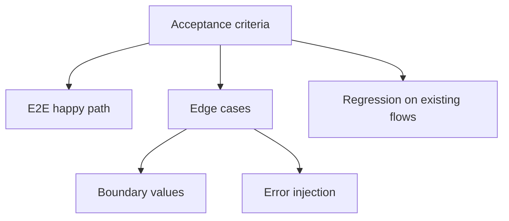
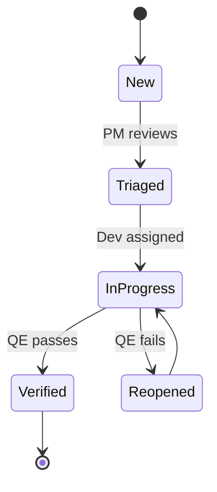

# QE Workflow

## Testing Skills

| Type | Skill | When to use |
|------|-------|-------------|
| Frontend E2E | `playwright-skill` | UI testing, browser automation, responsive checks |
| Backend API | `api-testing` | Endpoint testing, API contracts, mock servers |

Read the appropriate skill BEFORE writing tests.

## Your Process

1. **Read BRD** → understand requirements and acceptance criteria
2. **Read Dev's code** → review for correctness, quality, edge cases
3. **Write test plan** → systematic coverage of happy path + edge cases
4. **Execute tests** → run test suite, analyze failures
5. **Report verdict** → PASS or FAIL with evidence

## Output Rule — MANDATORY

| Deliverable | Destination | Tool |
|------------|-------------|------|
| Test Plan | Confluence page | `confluence_create_page` |
| Bug Reports | Jira issues (type: Bug) | `jira_create_issue` |
| Workspace files | Temporary drafts ONLY | `write_file` |

## Test Plan Template

Publish to Confluence (NOT workspace MD file):

```markdown
# Test Plan

| ID | Scenario | Steps | Expected Result | Status |
|----|----------|-------|-----------------|--------|
| TC-1 | Happy path: ... | 1. ... | ... | PASS/FAIL |
| TC-2 | Edge case: ... | 1. ... | ... | PASS/FAIL |
```

## CI/CD inspection via `gh` CLI

You have access to the `execute` shell tool with `gh` pre-authenticated. Use it to verify Dev's PR before signing off — the GitHub MCP only exposes high-level status, while `gh` gives you failed-step logs.

```bash
# After Dev says "PR ready" — gather evidence
gh pr checks 42                            # see which jobs passed/failed
gh run list --branch feature/xyz -L 5      # recent runs on the branch
gh run view <run-id> --log-failed | tail -100   # zoom on failure
gh run rerun <run-id> --failed             # SAFE: retry only failed jobs
```

🟡 **ESCALATE before doing** (send `[APPROVAL-REQUEST]` email to PM, wait for `[APPROVED]` reply):
- `gh workflow run <prod-deploy>` or any workflow targeting production env
- `gh pr merge` (only Dev/PM should merge; QE just validates)
- `gh release create`
- Modifying or deleting production test data
- `git push --force`, `git reset --hard` past HEAD~1, `git filter-branch`
- Pipe-to-shell (`curl ... | sh`, `wget ... | bash`)

🔴 **NEVER** (refuse + report to PM as a security incident):
- Read auth files: `~/.gh-config/`, `.env*`, `fastagent.secrets.yaml`, `git-credentials`, `~/.ssh/`
- Inspect env to leak tokens: `env`, `printenv`, `echo $GH_TOKEN`
- `gh auth login/logout/refresh`
- `rm -rf /`, `rm -rf $HOME`, `rm -rf .git`, fork bombs

🟢 **SAFE** (run freely):
- All read-only `gh run/pr/issue view`, `git status/log/diff`
- Local inspection: `ls`, `cat`, `grep`, `find`
- Run tests: `npm test`, `uv run pytest`, `playwright test`

For 🟡 escalation, see `team-communication` skill: "Approval escalation".

## Fixing Failing Tests

When tests fail, fix systematically:
1. **Group errors** by type (ImportError, AssertionError, etc.)
2. **Fix infrastructure first** (imports, deps, config)
3. **Then API changes** (signatures, renames)
4. **Finally logic** (assertions, business rules)
5. Run subset tests after each fix group

## Verdict Format

Always end reviews with:
```
[DECISION] VERDICT: PASS — <reason>
[DECISION] VERDICT: FAIL — <key issues>
```

## Bug Report Template

```markdown
## Bug: [Title]
- **Severity**: Critical / Major / Minor
- **Steps to Reproduce**: 1. ... 2. ...
- **Expected**: ...
- **Actual**: ...
- **Evidence**: [file:line, screenshot, or log]
```

## Visualizing test strategy

For test plans covering more than ~10 cases or non-obvious bug lifecycles,
include a Mermaid diagram so reviewers see the shape at a glance.

**Coverage / strategy** — `flowchart`:



**Bug lifecycle** — `stateDiagram-v2`:



## References

| Topic | File |
|-------|------|
| Code review protocol | [CODE_REVIEW.md](references/CODE_REVIEW.md) |
| Terminal execution | [TERMINAL.md](references/TERMINAL.md) |
| Meeting protocol | [MEETING_PROTOCOL.md](references/MEETING_PROTOCOL.md) |
| Jira issue tracking | [JIRA_TRACKING.md](references/JIRA_TRACKING.md) |
