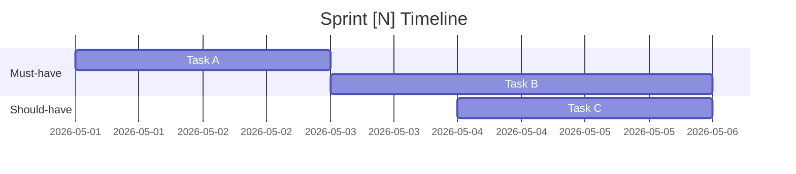
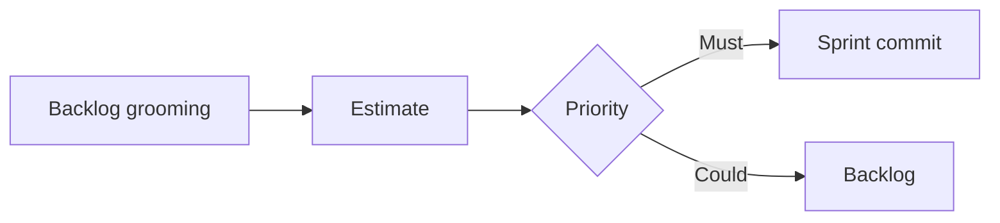

# SPRINT PLANNING

## Process

1. **Review backlog**: Read list of incomplete tasks/features
2. **Estimate effort**: Use T-shirt sizing (S/M/L/XL)
   - S: < 30 min, 1 member
   - M: 1-2 hours, 1-2 members
   - L: 3-5 hours, 2-3 members
   - XL: > 5 hours, must be split
3. **Prioritize**: MoSCoW method (Must/Should/Could/Won't)
4. **Assign**: Select needed members (see team-roster)
5. **Output**: Sprint plan on Confluence + Jira issues

## Backlog Creation (for Analysis projects)

When the team is doing analysis/evaluation, the backlog IS the deliverable:

1. **Collect inputs** from team members (BA gap analysis, SA architecture review, Dev code analysis)
2. **Create Jira stories** for each improvement item:
   - Summary: `[IMPROVEMENT] <concise title>`
   - Description: Problem statement, proposed solution, expected impact
   - Priority: Must/Should/Could/Won't
   - Estimate: S/M/L/XL
   - Acceptance Criteria: Definition of Done
3. **Create sprint**: `jira_create_sprint(board_id, name)`, move prioritized items in
4. **Publish sprint plan**: `confluence_create_page` with full overview + priority rationale

## Sprint Plan Template

Publish to Confluence (NOT workspace MD file):

```markdown
# Sprint [N] Plan
## Goal: [Sprint objective]
## Duration: [Start date] → [End date]

| # | Task | Priority | Size | Assigned | Jira Key | Status |
|---|------|----------|------|----------|----------|--------|
| 1 | ...  | Must     | M    | Minh - Dev | JAR-xx | TODO   |
```

## Visualizing the sprint

When the sprint timeline or task dependencies need to be reviewed by stakeholders,
embed a Mermaid diagram alongside the table — the dashboard renders it inline.

**Gantt** for the timeline:



**Flowchart** when tasks have ordering / dependency:



Use a diagram only when it adds clarity beyond the table — skip for tiny sprints.

<planning_rules>
1. XL tasks MUST be split into M or S tasks — no exceptions
2. Each sprint should have no more than 5-7 main tasks
3. Must-have tasks MUST have sufficient resources assigned
4. Every task needs a clear Definition of Done
5. Sprint plan MUST be on Confluence, individual tasks MUST be Jira issues
</planning_rules>
