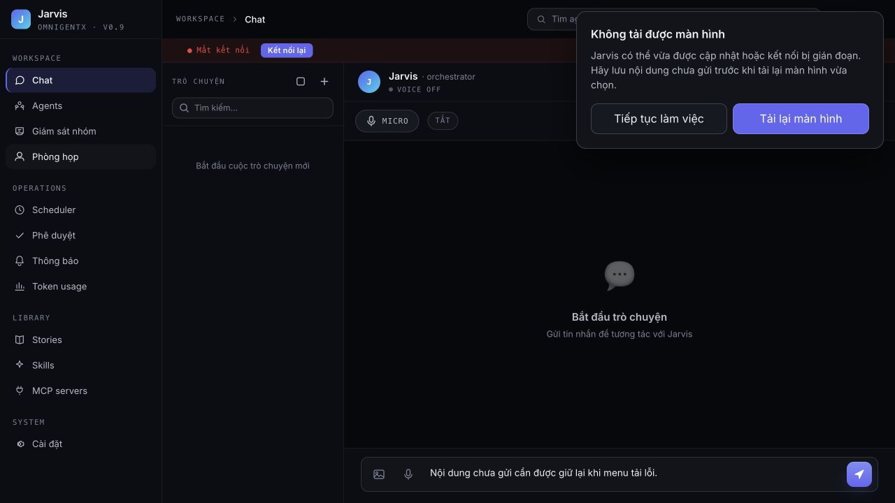
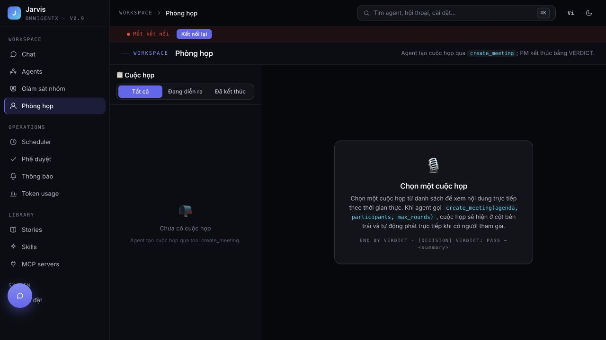
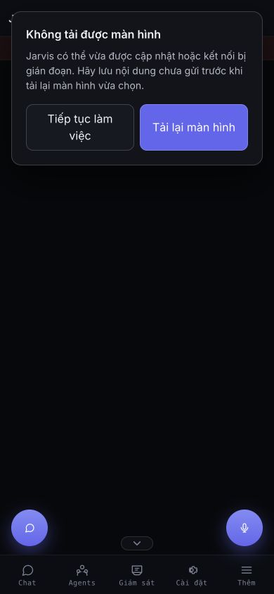

# SCRUM-38 — Dashboard lazy-route recovery

## Observed production failure (2026-09-28)

User screenshot: navigation attempted `/assets/MeetingsView-CdfOtDfD.js`, received 404,
then `TypeError: Failed to fetch dynamically imported module`.
Read-only HTTP verification after v3.0.0 deploy:

- Old chunk `/assets/MeetingsView-CdfOtDfD.js`: **404**.
- Current document references `/assets/index-BTCEDaUH.js`.
- Current entry references `/assets/MeetingsView-BAdUleCy.js`: **200**.
- Current production tab successfully opened Meeting Room through the menu.

The live browser held references to a prior build. Docker replaces the static
asset directory on deployment, so an old entry's unloaded lazy chunks disappear.
The existing router had no error recovery and HTML had no explicit cache policy.
The separate API 502/QUIC errors in the screenshot are not explained or fixed by
this change; no evidence supports treating those as the cause of module 404s.

## Fix and scope

- Global router handles known JS/CSS module loading errors across all lazy views.
- A localized, nonmodal notice offers **Reload page** or **Keep working**.
- No automatic reload: unsent form/chat state is retained until the user chooses
  to reload; the notice asks them to save it first. Reload does not save drafts.
- Reload navigates to the requested same-origin route including query/hash.
- Persistent 404/offline failures cannot cause an automatic reload loop.
- Successful navigation clears the notice; unrelated runtime/API errors are not
  misclassified as an obsolete bundle.
- Nginx serves entry HTML (including SPA fallback) with `Cache-Control: no-store`.
  Existing hashed-asset caching remains intact.

A tab already running the old release cannot receive this handler retroactively.
Reload it once to load the newly deployed frontend. No server API or meeting data
changes are required. The fix needs merge/deployment to become available in production.

## Verification

- Frontend production build: PASS.
- Full frontend unit suite: **237 passed** (includes 9 route recovery tests with
  real Vue Router navigation: browser error variants, negative controls,
  query/hash preservation, dismissal, initial-route failure).
- New E2E suite against built assets with mocked backend: **8 passed**.
  All six reported menus (Meeting Room, Settings, Token usage, Scheduler, MCP
  servers, Approvals): missing JS, preserved draft, dismiss, repeated navigation,
  user reload, still-missing initial route without automatic retries.
  Meeting Room additionally restores the chunk and recovers at 1280px and 390px.
- Existing chat streaming, auth reload recovery, setup wizard E2E: **8 passed**.
- GitNexus staged scope check: 6 changed symbols, low risk; expected frontend scope.
  Worktree indexed locally; explicit local backend handle avoids duplicate repo-name
  resolution in the installed GitNexus global registry.
- Real `nginx:1.27-alpine` integration: **1 passed**. `/`, `/index.html`,
  `/meetings`, and `/settings?tab=general` return the entry with no-store;
  existing JS retains immutable caching; missing JS returns 404 without immutable.
- Computer-use: browser clicks on local built UI, server deliberately returns
  404 for Meeting Room JS; typed unsent text remains visible. Restored asset,
  clicked reload, verified Meeting Room rendered. Also inspected initial-route
  failure at 390×844. Screenshots below are local fixture data, not production
  activity. The disconnected indicator is from the finite fixture SSE stream.

Commands (from frontend):

```sh
npm run build
npm run test:unit
PW_PORT=3015 npm run test:e2e -- --project=chromium-desktop tests/e2e/flows/route-load-recovery.spec.ts --workers=2
RUN_DOCKER_TESTS=1 node --test tests/deployment/cache-headers.test.js
```

## UI evidence




