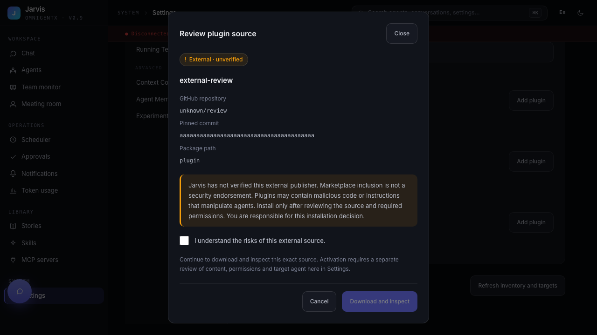
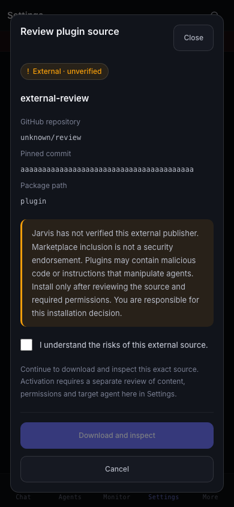
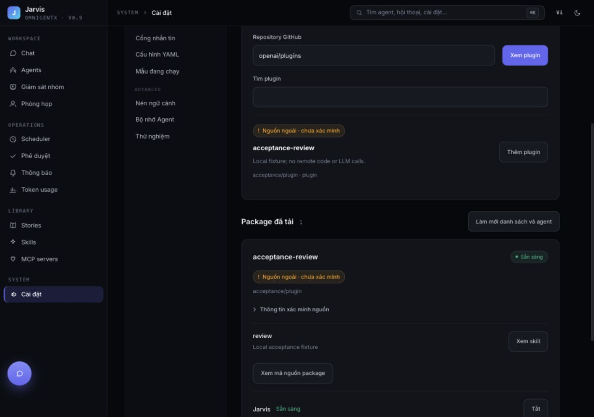
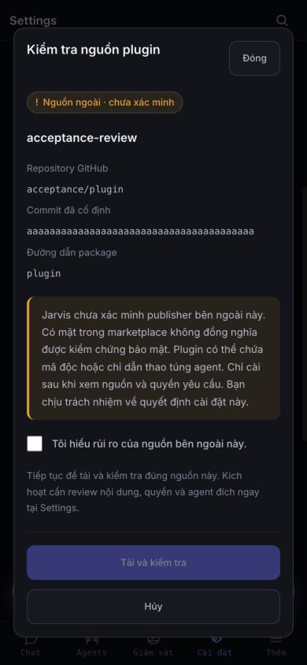

# Plugin source and manual review UX

## Decisions
- Backend derives official repository identity from an exact allowlist, never manifest publisher labels. External entries in an official catalog are labelled community, not official.
- Inventory recomputes source identity. It does not claim historical marketplace provenance when that provenance has not been persisted.
- Source reputation and live runtime availability remain separate.
- Authenticated manual install has explicit source confirmation. Manual activation reviews content, target, digest and sandbox policy in Settings, with a short-lived server-signed confirmation. MCP adapters still use human approvals.
- Third-party files render as text. Unsupported capabilities remain blocked. Ready still requires runtime acknowledgement.
- Review tokens expire after ten minutes. The signing identity is persisted in the protected runtime SQLite database so workers and restarts share the same review identity.

## Verification
- 63 backend tests passed (44 targeted + 19 activation/policy/sharing/live-runtime regressions): source spoofing, unknown repositories, catalog provenance, forged/expired/stale review confirmations, real SQLite lifecycle activation with a mocked runtime ACK, and HTTP install/review/activate against a real McpAgent with immediate read_skill success, agent approval preservation, routes and installation.
- 244 frontend unit tests passed.
- 7 Playwright tests passed, including 390 × 844 mobile layout, explicit risk consent, Escape cancellation, package text escaping and truthful activation failure.
- Frontend production build passed. Existing bundle size warnings remain.
- Screenshots below are from mocked API Playwright tests, not a production installation or a live LLM/team run.

## Outstanding acceptance
- External marketplace download and executable MCP sandbox acceptance were not rerun; source acquisition and sandbox behavior are unchanged.
- Agent-created pending install requests visible in Settings, durable continuation after approval, and requesting agent/run attribution. This change preserves that approval flow but does not repair its missing continuation.

## Computer-use acceptance

Used the UI at localhost:3035 against an isolated local FastAPI application, real SQLite lifecycle and real McpAgent. Marketplace discovery and acquisition were substituted with a self-authored fixture; app boot endpoints used test fixtures. No production mutation, external software execution or LLM calls.

Clicked Add, verified disabled confirmation before risk acknowledgement, downloaded the fixture, selected Jarvis, opened and read SKILL.md in the activation dialog, confirmed activation and observed Ready for Jarvis. The same runtime immediately returned `LOCAL_UI_IMMEDIATE_SKILL` from read_skill (see live-read-skill.json). Cancelled a second source review without installing.

Tracking: SCRUM-52 (implemented source/manual UX); SCRUM-53 (agent approval continuation and pending request visibility follow-up).
