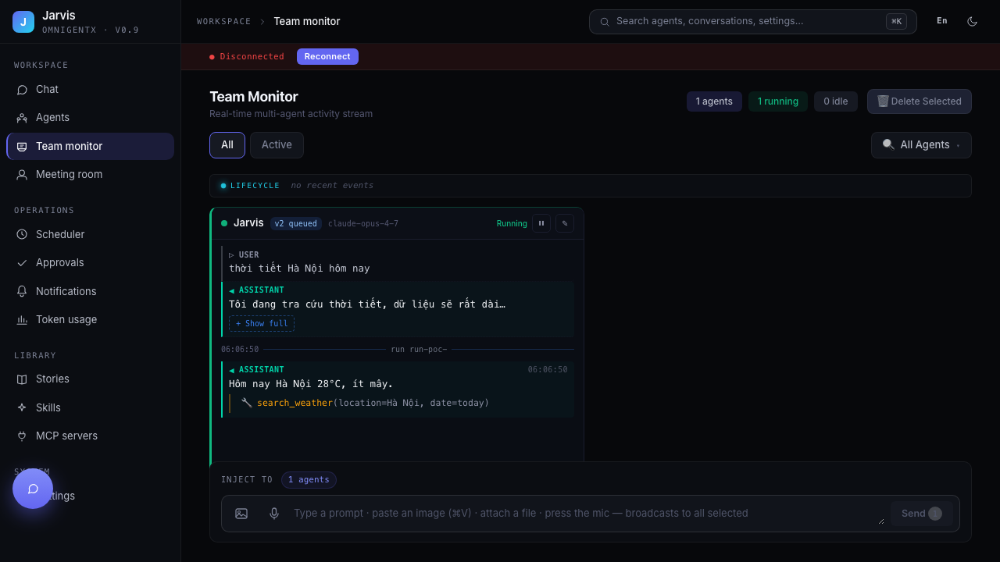
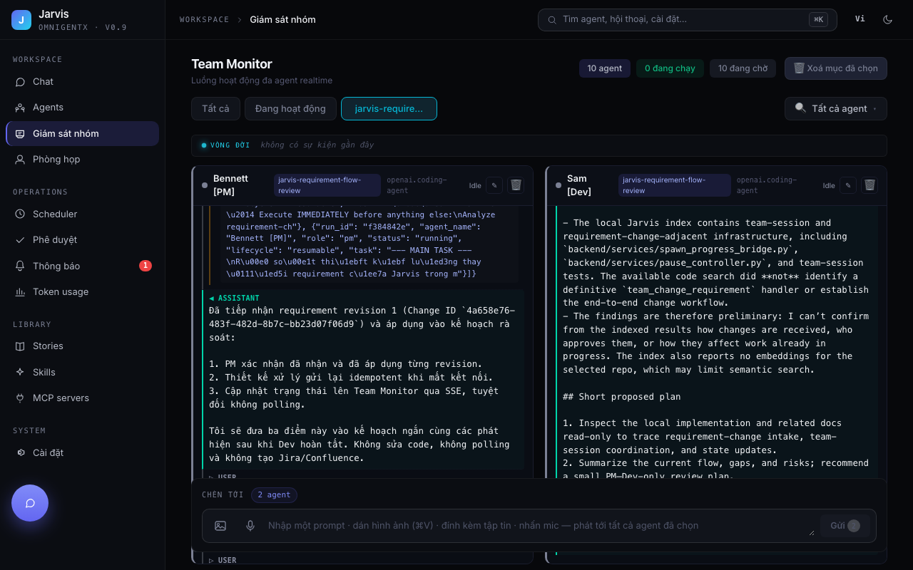

# PR #159 acceptance evidence — 2026-09-27

## Current review checkpoint — 2026-09-28

PR #159 now includes the scoped restart/identity recovery first developed in
stacked PR #163. Review the consolidated head as one Jarvis change, with
fast-agent #14 and mcp-atlassian #5 as dependencies. Earlier observations
below remain dated evidence of the defects before repair.

- **Real localhost team E2E:** Jarvis Chat created independent sessions
  `450bcd26` and `14688e5f`. The second team received two user requirement
  changes through Chat. A role-only lifecycle event reproduced a wrong PM
  wake (`pm`); after the fix, Monitor injected River [Dev] returned
  `ACK-REPAIR-02`, the worker cycle woke Bailey [PM], Bailey connected 9/9
  MCP servers and answered, and the full team cycle notified the user.
  [Detailed log and UI screenshots](../pr163/session-routing-acceptance.md).
- **Cloud MCP E2E:** on the test tenant, real MCP Jira search full/brief,
  Confluence full/metadata and version diff, and selected Jira attachment
  download succeeded. A 50-byte uploaded attachment was returned byte for
  byte. Jarvis's team created and updated Jira SCRUM-35 and Confluence page
  98855 through the MCP. [Exact Cloud call results](https://github.com/omnigentx/mcp-atlassian/pull/5#issuecomment-5858118577).
- **Jira state:** SCRUM-35 Done; SCRUM-36 closed as duplicate; SCRUM-32 and
  SCRUM-30 In Progress pending review. Confluence page 98855 version 9 records
  the team rerun and MCP Cloud checks.
- **Tests on the consolidated merge candidate:** backend non-Cloud full
  suite 2,293 passed, 4 skipped, 1 xfailed; frontend unit 228 passed;
  frontend build passed; full Playwright suite 109 passed, including the
  desktop/mobile browser matrix. The first consolidated-head CI run passed
  backend and build but failed one Monitor E2E: its fixture assigned a team
  session to a revision event while the roster declared the same Jarvis agent
  as static, temporarily rendering two identities (2/4 turns). The fixture
  now uses one session identity. A separate regression covers a real race:
  a live SSE turn arriving before `/messages` must render reactively and
  survive the slower history response. The new head still requires green CI.
  The full backend test process retained a multiprocessing child after the
  summary, then exited 0 once that child was terminated. The pushed head
  must pass its own CI before changing review state.
- **Remaining scope:** real UI duplicate-name team creation is currently
  blocked by the global name allocator; socket/HTTP fixture tests exercise
  duplicate-name isolation. Crash-time exactly-once side effects, excess
  context on resumed agents, and the local test-harness child leak are
  tracked as backlog. Team B's measured 58 model calls cost an estimated
  USD 0.877; one 10-token ACK reply loaded 41,115 input tokens. This is a
  cost finding, not proof that any particular content can be dropped.

This evidence was collected on `codex/atlassian-mcp-output` after merging
`origin/main` (which includes Jarvis PRs #160 and #161). The only conflict
resolution in Jarvis retains both the team-work and model-selection tools,
routes both RPC handler sets, and keeps both caller-identity names. The
fast-agent submodule combines the session-inbox work with its current main
and the model hook used by #161.

## Reproducible checks

| Check | Command / method | Result |
| --- | --- | --- |
| Jarvis backend | `cd backend && UV_FROZEN=1 uv run pytest -q tests/` | 2,255 passed, 4 skipped, 5 deselected, 1 xfailed, 2 warnings. Pytest printed the summary in 123.82 s but then waited on a leftover multiprocessing child; terminating that child let the command exit 0. The process-cleanup defect needs a separate issue. |
| Team subprocess | `cd backend && UV_FROZEN=1 uv run pytest -q tests/e2e/test_team_spawn.py tests/e2e/test_team_multi_member.py` | 5 passed, 1 skipped. This verifies snapshots and shared session identity, not a live LLM team task. |
| Team/model backend regression | `cd backend && uv run pytest -q tests/test_services/test_team_work_service.py tests/test_services/test_team_work_hooks.py tests/test_routes/test_team_work_routes.py tests/test_routes/test_inject_path_a_feedback.py tests/test_team_model_runtime.py tests/test_model_selection_server.py tests/test_services/test_model_selection.py tests/test_isolated_model_hook_wiring.py` | 37 passed before the live findings. After the fixes, `tests/test_services/test_team_work_service.py` passes 8 tests, including a regression that requires PM wake on the running event loop. Ruff passes. |
| fast-agent inbox isolation and routing | `cd backend/fast-agent && uv run pytest -q tests/unit/spawn/test_parallel_team_workspaces.py tests/unit/spawn/test_team_message_scope.py tests/unit/spawn/test_team_message_routing.py tests/unit/spawn/test_inbox_auto_resume_identity.py` | 12 passed; changed server module passed Ruff. |
| Atlassian focused unit tests | `cd backend/mcp-atlassian && UV_FROZEN=1 uv run pytest -q tests/unit/servers/test_jira_server.py tests/unit/servers/test_confluence_server.py tests/unit/jira/test_attachments.py tests/unit/confluence/test_attachments.py` | 228 passed. The earlier full Atlassian suite had 10 failures also reproduced on its clean base; a full rerun on this merged state was not performed. |
| Browser | `cd frontend && npm run build && PW_PORT=3004 npx playwright test tests/e2e/flows/team-monitor-v2.spec.ts tests/e2e/flows/agent-model-selection.spec.ts --project=chromium-desktop` | Build passed; 8 passed. The first run before rebuilding `dist` displayed an old bundle and failed 5 model-selection tests. Rebuilding restored all 8 passes. Browser tests use deterministic API/SSE fixtures. |

## Live Cloud read probe

Using the ignored local credentials, the PR's JiraFetcher and
ConfluenceFetcher read from the recreated Atlassian Cloud tenant without
writing data. A SCRUM search returned 10 issues. The full search projection
contained `description` on all 10; the `brief` projection removed it on all
10. Serialized JSON measured 13,706 versus 4,586 characters. A Confluence
page returned 1,844 content characters; the full page JSON measured 2,270
characters and metadata measured 381. This is an output-size observation,
not token, latency, answer-quality, or task-level savings. The prior
multi-step A/B measurements and their limits remain in
`docs/atlassian-multistep-measurement.md`.

## Live localhost E2E and visual evidence

The image above is a deterministic SSE fixture. The following image is from a
real localhost browser session, backend, LLM, and PM/Dev subprocesses:

From `/chat` a user asked Jarvis to create a PM+Dev design-review team, then
changed its requirements while it ran. Jarvis created session `42327d0a`;
Bennett [PM] and Sam [Dev] ran. Revision 1 (`4a658e76-483f-482d-8b7c-bb23d07f06d9`)
was delivered to the PM inbox and the PM's Team Monitor turn explicitly
acknowledged it. No Jira, Confluence, GitHub, or source changes were requested
from this test team.

After a backend restart, revision 2 (`8e2de231-1c23-497e-937f-8491825bea1f`)
was recorded as delivered, but remained unread and produced no PM run. The
root cause was `deliver_revision` calling `auto_wake_if_idle` inside
`asyncio.to_thread`; the dead-agent branch requires the running event loop to
schedule a resume. The fix calls it on the loop thread. A subsequent natural
UI request created revision 3 (`99aa4609-5fbf-4670-9bf8-926b20f66080`).
The PM resumed as run `0785b690`, consumed both inbox messages in revision
order, and reported both in its result. The processed-message file contains
`ccece064` (revision 2) and `c531559d` (revision 3). Team Monitor showed
the same messages in the PM's turn. This verifies catch-up after restart; it
does not establish automatic recovery of a previously queued revision if no
new event arrives. `delivered` means queued, not acknowledged or applied.

The first live turn also showed Jarvis's `team_find` returning no match for
words present out of order in the team brief, forcing a second tool call to
`get_team_status`. Search now matches escaped terms independently. The API
also returned `delivered_at=null` immediately after delivery; it now returns
the persisted timestamp. Unit regressions cover both changes.

### Observed limitations, ordered by impact and ease

1. **P1 — team workspace source access:** PM and Dev tried to inspect the
   localhost repo, but `filesystem__directory_tree` denied the path outside
   the isolated team workspace. The Dev used a stale GitNexus index and could
   only give inconclusive findings. Provide a narrow read-only source mount
   or a repository-aware search tool, without widening write access.
2. **P1 — durable acknowledgement:** There is no persisted `received` /
   `applied` state. A delivered revision can remain unread after restart until
   another event wakes the PM. Add a startup wake for unread session inboxes
   and explicit PM acknowledgement before the UI claims application.
3. **P1 — communication policy:** The PM used `email` as a fallback because
   `reply_to_message` was absent from its toolset, even though the live task
   explicitly prohibited email. Expose an appropriate reply tool or prevent
   the fallback and test agent behavior against the instruction.
4. **P2 — excess context:** PM read two full skill files twice after a second
   run; `get_team_result` returned the entire team result even after status
   was known. Measure tokens per multi-step task before changing defaults.
5. **P2 — process cleanup:** The full backend pytest run printed a successful
   summary but waited on a leftover multiprocessing child until it was
   terminated. Investigate fixture/process teardown separately.

The live run did not execute a complete Jira/Confluence writing workflow or
measure task-level token cost, quality, or latency. The Cloud probe above is
read-only and measures only serialized response size.

## Reviewer decision points

- The Jarvis PR depends on fast-agent PR #14 (now rebased on current main and
  including the model hook from #17) and mcp-atlassian PR #5. Review and merge
  those submodules before merging Jarvis #159.
- The per-user seven-day searchable content cache remains a measured design
  proposal; no cache or cleanup implementation is in this PR.
- Generated MCP approval is content-bound but still executes under the shared
  backend OS identity. Per-agent private skill/MCP scope, sandboxed execution,
  and controlled global promotion are follow-up work.
- The live browser-to-Jarvis-to-team requirement-change path is verified, but
  the team could not inspect the source tree and did not write Atlassian
  artifacts. Do not infer a complete production self-improvement flow.
