# Runtime plugin acceptance — SCRUM-42

Local acceptance completed on 2026-10-01. PR168 becomes Ready for review only
when its final CI checks pass. Dependency: omnigentx/fast-agent PR19 first.
No production deployment or merge was performed.

## Implemented design

```mermaid
flowchart LR
  Catalog[GitHub catalog] --> Source[Human source approval: repo + commit + path]
  Source --> Fetch[Bounded runtime fetch + blob verification]
  Fetch --> Inspect[Common immutable descriptor + content digest]
  Inspect --> Review[Human content + target + policy review]
  Review --> Control[Runtime capability controller]
  Control --> Boundary[Public ToolRunner hooks: safe LLM boundary]
  Boundary --> Adapter[Scoped skill reader / sandboxed stdio MCP]
  Adapter --> Ack[Actual runtime ACK]
  Ack --> Store[SQLite bindings + SSE]
  Control --> IPC[Private correlated IPC for existing team subprocess]
  IPC --> Boundary
```

- Claude, Codex and portable manifest adapters feed the same inventory and
  activation lifecycle. Format-specific overlays, source normalization and
  unsupported contributions have explicit tests. Catalog discovery is not a
  claim that every vendor plugin works in Jarvis.
- UI browses a public GitHub catalog, fetches only the selected pinned subtree,
  exposes files as bounded escaped text, and selects the target explicitly.
  Jarvis does not bundle third-party plugin packages. Upstream terms still need
  review; runtime acquisition is not a license exemption.
- Ready is based on an actual skill/tool attachment ACK. Team bindings use stable
  session+agent identity across resume; run IDs address the live private socket.
  Confirmed dead PIDs cannot create an ambiguous live target. Unknown/conflicting
  processes fail closed. Updates synchronize existing ToolRunners at boundaries.
- Namespaced skills use the public registered reader even when filesystem access
  is restricted. MCP tools use a pinned host-controlled OCI image. No host shell,
  network, credential inheritance, Docker socket or package installer is granted
  to plugin processes. Explicit credential slots are encrypted and policy changes
  invalidate approval. Tool/metadata/server/concurrency/deadline budgets apply.
- Disable removes only that target's capabilities. Global promotion requires a
  separate human review; stopping global sharing prevents future inheritance and
  does not silently remove current bindings. Resume restores reviewed bindings
  before the first model call. SSE supplies UI updates; there is no status polling.
- Unsupported hooks, commands, LSP, remote MCP and host connectors remain blocked.
  This is common supported-component compatibility, not complete Claude/Codex host
  emulation. The standard Compose backend does not supply a Docker execution
  profile; see `build/plugin-sandbox/README.md` for opt-in operator prerequisites.

## Tests and evidence boundaries

| Gate | Observed result | Evidence / limit |
|---|---|---|
| Entire backend suite | 2,487 passed, 1 skipped, 5 deselected, 1 xfailed, 7 warnings; 149.92s | `backend-entire-tests.txt`; actual OCI profile enabled |
| Focused plugin/backend suite before final wiring regression | 202 passed | `backend-tests.txt`; mocks are used for fault injection |
| Framework refresh/reader/hook regressions | 60 passed, 60.58s | `framework-tests.txt`; dependency PR19 CI also covers its full suites |
| Frontend unit tests | 244 passed | `frontend-unit.txt` |
| Plugin/approval UI regressions | 6 passed, 2.1s | `ui-tests.txt`; mocked backend, explicit desktop and 390px cases |
| Scoped Ruff / frontend production build | Passed | Existing bundle-size/import warnings remain |
| Real OCI boundary | Passed | UID65532; no host sentinel/network/root/package writes; real MCP initialize/list/call/detach |
| Real Jarvis UI/chat | Passed | Official frontend-design runtime package installed, reviewed, activated and then actually read |
| Existing live team: skill + MCP | Passed | Same team/run/PID during hot updates; details below |
| Computer-use layout | Inspected at 1440×900 and 390×844 | Real UI screenshots; document width equaled viewport width |
| Multi-step quality/cost comparison | Completed; **no token saving** | `live-multistep-ab.json`; one sequential real-provider A/B |

Framework full typecheck is not green: unchanged-source baseline has 77 diagnostics;
final tree has 76 and no new diagnostic messages. This known repository condition
is disclosed rather than reported as a passing type gate. Framework lint and its
GitHub checks pass. Current Jarvis CI is authoritative in PR168; an earlier run
caught a sync wiring gap that was reproduced and fixed before final submission.

## Real UI walkthrough and decisions

1. Runtime-fetched `anthropics/claude-code` frontend-design 1.1.0 at commit
   `732e167ee9d71296b4b63d6f529ac1334513826a`, package digest
   `b2e78c655ab3f098b982c5780fca0beba38b740a4a2827d7d01d8b6563febc3a`.
   Source and content approvals were separate. An initial approval paused Jarvis;
   plugin reviews now explicitly use the nonblocking approval path (paused/resumed 0).
2. Actual chat first hit the unrelated gated `skill_server__skill_get` tool 503.
   A filesystem read succeeded for Jarvis. This workaround was not accepted as
   evidence that a restricted team could use the plugin.
3. Jarvis spawned the real Plugin Acceptance team, session `30e68868`, with Casey
   [PM]. Its first PM review loaded Jira/Confluence, searched outside the allowed
   filesystem scope and read an old built-in frontend-design before activation.
   Jira comment 10417 / Confluence v3 are PM review output, not successful plugin
   activation. This distinction matters when reviewing the team's behavior.
4. After scoped activation, Casey's filesystem reader was denied. Source analysis
   found that fast-agent preferred filesystem tools and hid `read_skill`. PR19 adds
   a default-preserving public reader preference; Jarvis enables it for plugins.
   The resumed team then read the actual registered plugin and gave grounded output.
5. On final live run `0f16a6ca`, PID37636, UI Disable → Activate → fresh `read_skill`
   succeeded without restarting backend or replacing that run. The tool result
   identified the title and the line-length guidance from the actual 9,363-char file.
6. A first-party portable echo fixture was fetched from Jarvis commit
   `fe82dab07f5e495a9a93ac780f820dcdb0d1b20e` at
   `backend/tests/fixtures/plugins/echo`, reviewed in UI, given a networkless pinned
   image policy, approved for Casey and attached to that same run/PID. Casey called
   `plg-c621dbd7adc95f2e6c69__echo` and received
   `sandbox:runtime-plugin-team-20261001`. Disable acknowledged removal and left
   zero matching containers while the skill bindings stayed ready.
   This proves the controlled stdio adapter, not arbitrary third-party MCP software.
7. Runtime restart/resume was tested separately and is not presented as hot-update
   evidence. Dead prior runs were ignored; the same logical team resumed with its
   approved reader before the first model call. Main Jarvis's binding also restored.
8. Manual mobile inspection caught misleading red review flags on a Ready MCP card
   and an empty target placeholder. Both were reproduced by UI tests and corrected.
   A terminal event racing an in-flight snapshot also had a red→green regression.
9. CI caught sync hook registration assuming an event loop. The model-hook test now
   uses a real McpAgent; lazy bootstrap preserves sync registration and launches once
   at the first async boundary. Existing asynchronous startup behavior remains tested.

`live-team-tool-evidence.json` contains controlled calls/results, with local paths
redacted. Third-party skill bodies are represented by hash, length and a short
excerpt; they are not vendored into the evidence bundle. Screenshots show actual
UI, except the older `plugins-desktop.png` / `plugins-mobile.png`, which are mock
failure-state evidence. Before-fix photos are labeled in their filenames.

## Actual three-step A/B interpretation

| Variant | Input | Output | Total | LLM calls | Tool calls | Elapsed |
|---|---:|---:|---:|---:|---:|---:|
| Full skill in initial instruction | 12,128 | 252 | 12,380 | 3 | 0 | 17.436s |
| Metadata + on-demand reader | 16,582 | 334 | 16,916 | 4 | 1 | 34.806s |

Both variants gave grounded title/line-length answers and relevant design checks.
The JSON includes actual inputs, outputs and provider usage for each step.
The on-demand variant read once and reused history for the following steps, but
its extra tool round trip cost **36.6% more total tokens** for this task, which
requires the skill. Elapsed time was higher in this one sequential sample; it is
not a statistical latency claim. Cache-hit counts are reported separately and
are already included in OpenAI input tokens, not added a second time.

This is isolated real fast-agent usage, not full Jarvis/team overhead, all testing
costs or a workload-level savings result. The custom proxy model has no verified
monetary price here, so no dollar-cost claim is made. On-demand is retained for
scoped explicit loading and capability control; broader default optimization
requires workload measurements under SCRUM-16/21. No speculative prompt edit was made.

## Runtime file lifecycle and cleanup plan

- Download bytes live under private runtime storage. A lease and shared stage lock
  protect in-flight work; cancellation/timeout removes its temporary tree.
- Verified immutable snapshots are referenced by SQLite. 64 non-expired candidates
  × 16 MiB establishes a maximum 1 GiB snapshot budget; new acquisition fails at quota
  rather than evicting active work. Four concurrent downloads have a 180s deadline.
- Inactive, definitively disabled/rejected/unsupported/known-failed content expires
  after 24h inactivity. Daily housekeeping plus install-time cleanup removes bytes
  and encrypted policy. Active, globally shared, transitional or uncertain bindings
  remain pinned until removal is acknowledged. Output/user data is not package data
  and is outside this purge. The separate seven-day Atlassian cache is unchanged.
- Crash-leftover download/UUID directories expire only when untracked, old, unleased
  and not symlinks. Abandoned IPC inodes require a refused endpoint probe and an
  unchanged inode; live/unknown/foreign endpoints remain untouched.
- Operation locks use 256 candidate + 256 namespace shards and two shared locks;
  they do not grow by installation count and are never unlinked during operation.
  SQLite audit identity/hash/binding records intentionally remain after byte expiry.
  This retention job is housekeeping, not agent-status polling.

## Backlog and remaining scope

- [SCRUM-43](https://omnigentx.atlassian.net/browse/SCRUM-43): review read-only
  skill tool semantics when self-improvement is disabled (small/high value).
- [SCRUM-44](https://omnigentx.atlassian.net/browse/SCRUM-44): incompatible Finance
  MCP SDK dependency at startup (small/high value).
- [SCRUM-45](https://omnigentx.atlassian.net/browse/SCRUM-45): meeting bridge uses
  hard-coded DB path rather than the configured isolated DB (small/high value).
- [SCRUM-46](https://omnigentx.atlassian.net/browse/SCRUM-46): diagnose backend
  shutdown retaining spawn socket after SIGTERM; root cause not yet established.
- Existing SCRUM-16/21 track repeated context/tool/schema costs and meaningful
  workload-level optimization. SCRUM-29 covers narrow repository access.
- Production Docker execution requires the documented operator profile. Remote MCP,
  networked plugin transports, executable hooks and host-specific connectors are
  deliberately unsupported and fail closed. True multi-user tenant isolation is
  not claimed by the current single-tenant authentication model.

GitNexus impact was checked before symbol edits. Shared lifecycle and public runtime
surfaces have HIGH/CRITICAL callers; relevant lifecycle/model/hook regressions and
full suites were run. Precommit change detection stayed within plugin UI/services,
approval's default-preserving pause option, model-hook integration and their tests.
Early graph traversal limitations were supplemented by direct caller/source reads;
they are not represented as complete graph coverage. No production changes occurred.
