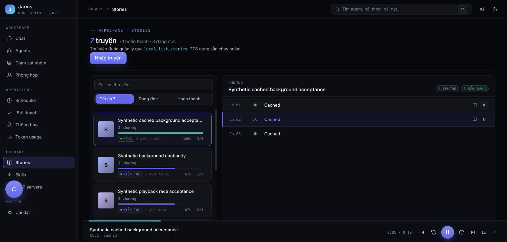

# Story auto-next: application regressions and acceptance

Tracks SCRUM-64, alongside SCRUM-62 in PR #176. Only synthetic chapters appear in tests and screenshots.

## Findings established from source and failing regressions

1. The previous `useAudioPlayer` ended handler always awaited a HEAD status request, then a Vue tick. `audioPlayer.nextChapter` subsequently awaited POST /play before the URL watcher called native audio.play. Native audio was idle across these asynchronous boundaries even for a complete cached file.
2. Resuming saved progress without opening the chapter list did not restore the playlist. The player therefore treated the selected chapter as the last chapter and closed instead of advancing.
3. An earlier play response could overwrite a newer selection or a closed player. MediaSession setup also allowed one unsupported action to reject the successful playback chain.

Before implementation, the two new store regressions failed (6 passed, 2 failed). Running the two engine regressions against a copy of the previous engine failed both: queued playback was not started in the ended task, and visibility/pageshow did not recover a missed ended event. They now pass. These establish application defects; they do not establish the exact OS behavior on the user's unspecified phone.

## Implementation

- Prepare exactly one next chapter's URL/status/duration in advance using authenticated POST /prepare. This registers existing TTS text but does not generate audio, cancel pre-generation, or advance reading progress. No content is returned to the browser by this request.
- At the end of a known complete chapter, consume that metadata and call native play synchronously in the ended task. The progress POST is performed afterwards without blocking playback. There remains a network request for the next audio itself; this is not zero-gap concatenation.
- Restore the canonical playlist when saved playback resumes; keep saved seek position. Guard late responses with selection revisions. Scope and cancel lookahead on story/chapter changes, stop, or type changes; its request has a 15-second timeout.
- For live audio, observe completion with existing authenticated SSE, retaining underrun recovery. Unknown generation state still requires HEAD; that probe now has a 15-second bound. No polling was added.
- Recover an ended chapter on visibility/pageshow; ignore duplicate and late ended events. Unsupported MediaSession actions do not stop playback.
- Validate chapter paths and reject symlink escapes, missing files and empty text. Only complete, parseable cache files without an active writer/lock are reported ready.

## Local automated results

| Gate | Result | What it establishes |
| --- | --- | --- |
| Frontend unit suite | 266 passed | Same-task native play, restored playlist, stale responses, scoped queue and optional media actions |
| Focused backend regression/integration | 23 passed | Prepare side effects, cache validation/path boundaries, existing writer and pre-generation races |
| Browser matrix | 30 passed | Audio/import flows on Chromium desktop, Chromium Pixel 5 and WebKit iPhone 13 emulation |
| Frontend production build | Passed | Compilation with new playback modules |

The new browser test decodes three actual synthetic PCM tracks with native browser audio. HEAD and next-chapter progress POST are deliberately left pending: playback must reach tracks 2 and 3 without awaiting either, then clear at the final track. A separate test injects prepare 503 and play 502, checks the spinner stops, and proves explicit retry succeeds. The unit engine tests additionally inspect native play before any microtask/Vue tick/network response.

Commands (from frontend):

```sh
npm run test:unit
PW_PORT=3042 PW_FULL_MATRIX=1 npm run test:e2e -- tests/e2e/flows/audio-autonext.spec.ts tests/e2e/flows/audio-player.spec.ts tests/e2e/flows/story-import.spec.ts
npm run build
```

From backend:

```sh
uv run --frozen pytest tests/test_routes/test_story_playback_queue.py tests/test_routes/test_tts_playback_races.py tests/test_services/test_tts_pregen_integration.py -q
```

## Computer-use acceptance with real Edge audio

Started the local backend through uv/uvicorn and operated Chrome UI. A synthetic three-chapter book uses completed Edge MP3 audio. Clicked play only on chapter 1; native Chrome media controls later showed **Ch.3: Cached**, **Pause**, and elapsed playback while the reader tab was unselected and the Settings tab was selected. The final chapter finished and cleared the player. A repeat run captured chapter 2 below after automatic advancement.



This proves desktop playback and native tab-switch continuation. A browser inspection reported document.visibilityState=visible despite the native unselected-tab observation, so this is NOT recorded as a verified hidden-document experiment.

A separate fresh-generation attempt hit an Edge provider failure on chapter 2 after three retries (`EdgeTTS produced no audio ... after retries`). The UI paused with no endless spinner. This failed attempt is not counted as successful three-chapter acceptance. Later pre-generation completed; the cached acceptance above tests transition independently of provider availability.

## Remaining physical-device gate

**Not verified:** the user's actual phone/browser, PWA mode and screen lock across multiple chapter boundaries. Device details have been requested. Desktop native media controls and mobile viewport/WebKit emulation cannot prove OS screen-lock behavior. If the OS completely suspends JavaScript before ended is delivered, this change recovers on return; it cannot promise uninterrupted background transitions while JS remains suspended.

The design removes the application's awaited control requests at a completed-track boundary. It does not guarantee next-chapter availability with lost network, failed Edge generation, or suspended JavaScript. These limits must remain explicit in review and release notes.

Relevant primary browser references: [WebKit ended/background issue 173332](https://bugs.webkit.org/show_bug.cgi?id=173332), [WebKit PWA background playback issue 261858](https://bugs.webkit.org/show_bug.cgi?id=261858), [Chrome Media Session](https://developer.chrome.com/blog/media-session/). These document browser constraints; they are not proof that the user's device has those specific browser defects.
