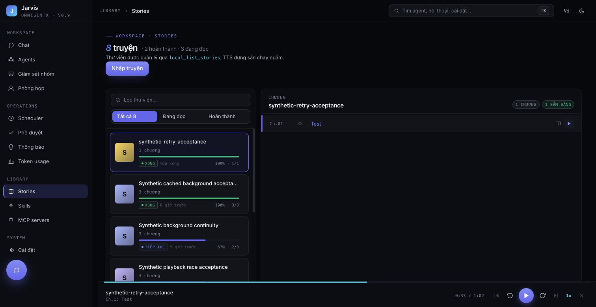
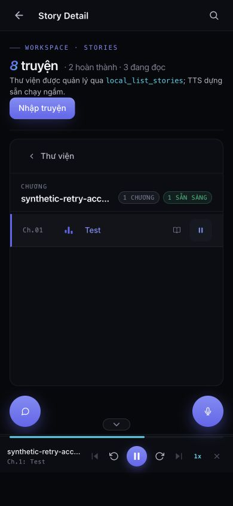

# Story speech failure recovery — SCRUM-65 / SCRUM-66

Only synthetic content is used in this evidence. No user story text, title,
source paths, credentials or raw production logs are included.

## Established causes

Edge returned no audio / timed out on individual chunks. The same Vietnamese
voice and source could succeed later. This does not prove Microsoft rate blocking
or a voice-list change.

Application defects amplified those failures:

- A failed chapter discarded every completed chunk and re-synthesized them next time.
- Failed high-priority chapters had no persisted retry delay and could repeatedly
  occupy the queue instead of allowing another chapter to proceed.
- False job results were not counted as failures. Early skipped tasks could leave
  the current-generation status set even though no writer was active.
- Media download failure paused the player without explaining how to recover.

The earlier PR changes address duplicate writers, partial MP3 publication,
stream underrun and chapter transitions. This revision adds durable verified
chunk checkpoints, per-content/voice/rate cooldown (60 seconds doubling to 15
minutes), accurate status/error accounting and localized error feedback.
Stories and pre-generation remain on Edge; chat voice settings are unaffected.

## Red → green regressions

Executing the prior pregen implementation against the new regression made its
retry fetch `A, B, C`; the repaired implementation fetches only `C` after `A, B`
succeeded. A separate HTTP-path integration verifies failure → HTTP 503 with
Retry-After → fresh runtime/provider → reuse → complete atomic file.

The browser HTTP-503 regression failed before the error notification existed;
it now verifies a visible explanation, no spinner and successful deliberate
retry decoding. A GC race regression failed when another writer renamed a temp
file between stat calls; it now passes without interfering with that writer.

Other regressions cover restart persistence, byte/hash corruption, changed text,
voice, rate or chunk partition, cancellation during disk open, exclusive writers,
7-day retention, quota cleanup and queue skipping without starvation.

## Real Edge + real local UI acceptance

A synthetic Vietnamese chapter split into four chunks of 45, 280, 458 and 392
characters. The fault harness left the first two network calls real, then injected
failure at the network boundary for subsequent chunks. This harness was temporary,
local only, and is not application code.

1. The first two NamMinh chunks were retained privately; the complete MP3 was not
   published. Retry attempts were delayed in the database, and a UI GET received
   HTTP 503 during cooldown.
2. Backend restarted with the fault removed. Pre-generation resumed from disk,
   calling Edge only for the remaining 458- and 392-character chunks. No calls
   repeated the first two chunks: **2 requests instead of 4 for this retry**.
   This measures synthesis requests for one sample, not LLM tokens or overall
   service cost.
3. The complete MP3 was atomically published: **375,840 bytes; 62.64 seconds**.
   SHA-256: `afe8d653ee998523bc72e4b4433496276fc1a30d5b718cc7342a816714df2c74`.
4. Chrome UI played the result, with clock advancing to **0:33 / 1:02**.
   Mobile viewport 390×844 also showed active playback without horizontal clipping.




`failure-desktop.png` captures the initial paused/no-spinner state before the
localized error-feedback addition; the final browser regression covers that addition.

## Cache lifecycle and limits

- Checkpoint identity hashes source, voice, rate and chunk partition. Files contain
  audio plus byte count/SHA-256, not chapter prose or names.
- Checkpoints survive failure/cancellation/restart. They are deleted after the
  complete MP3 is published; housekeeping failure does not invalidate ready audio.
- Opening a checkpoint lazily evicts inactive entries older than 7 days or over
  the 256 MiB auxiliary-cache target. Active writers are never evicted, so active
  chapters can temporarily exceed the aggregate target. A single chapter is
  bounded at 256 MiB and each chunk at 4 MiB.
- Retry metadata is retained up to 7 days and pruned on failure writes. Success
  clears the applicable delay. Existing DBs receive the additive table on first use.
- Browser status changes use existing SSE; no new polling loop is introduced.
- OS advisory locks target the existing macOS/Linux deployment.
- Chromium/WebKit mobile emulation and Chromium JS suspension are tested.
  **Physical iOS/Android screen-lock behavior is not proven by these tests.**
  That device-specific acceptance remains a separate SCRUM-64 follow-up.

## Reproduction commands

```sh
cd backend
uv run --frozen pytest tests/ -q
cd ../frontend
npm run test:unit
npm run build
PW_PORT=3051 PW_FULL_MATRIX=1 npm run test:e2e -- tests/e2e/flows/audio-player.spec.ts tests/e2e/flows/audio-autonext.spec.ts --workers=2
```

Final CI results and exact commit are recorded in the PR review comment.
